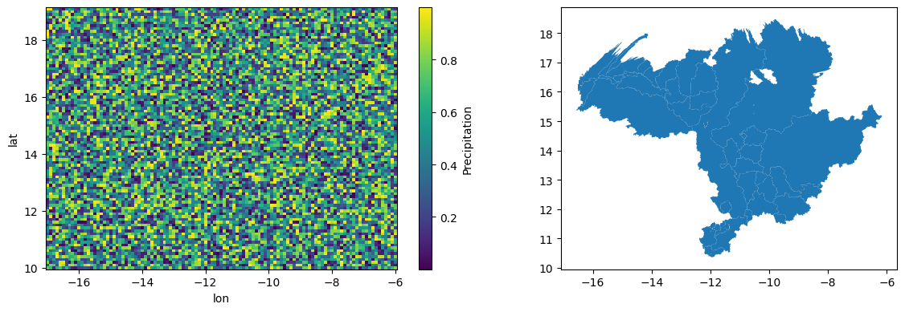
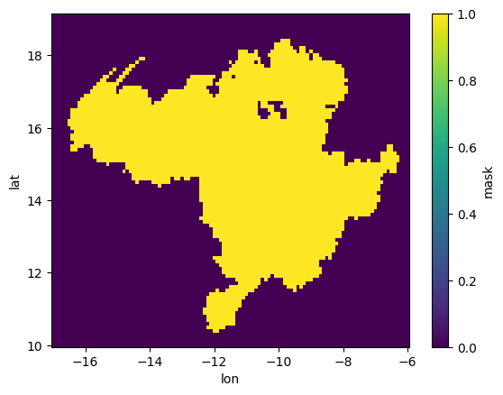

# Region

<!-- WARNING: THIS FILE WAS AUTOGENERATED! DO NOT EDIT! -->

------------------------------------------------------------------------

<a
href="https://github.com/iraind/omvs_senegal/blob/main/omvs_senegal/dataprep/region.py#L14"
target="_blank" style="float:right; font-size:smaller">source</a>

### get_region_mask

>  get_region_mask (ds:xarray.core.dataset.Dataset,
>                       gdf:geopandas.geodataframe.GeoDataFrame)

*Create a boolean xarray mask from all geometries in the GeoDataFrame.
Returns True for points within any geometry, False otherwise.*

## Example

#### Input

#### Output

