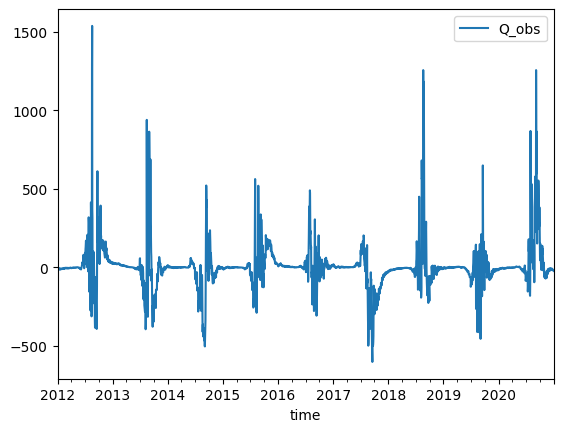

# Seasonal Handling


<!-- WARNING: THIS FILE WAS AUTOGENERATED! DO NOT EDIT! -->

#### Data loading

``` python
data = pd.read_csv(
    DATA_PATH/'hydro_example.csv', 
    usecols=['time', OBS_COL], 
    index_col='time',
    converters={"time": pd.to_datetime}
    )
data = data['2012-01-01':]
```

#### Season data handling

------------------------------------------------------------------------

<a
href="https://github.com/iraind/omvs_senegal/blob/main/omvs_senegal/dataprep/season.py#L10"
target="_blank" style="float:right; font-size:smaller">source</a>

### SeasonalityHandler

>  SeasonalityHandler ()

\*Class to handle seasonality operations in time series data.

This class provides methods to: - Compute seasonal patterns based on
week of year - Remove seasonality from data - Add seasonality back to
data

Attributes: seasonal_pattern: pd.DataFrame The computed seasonal
pattern, indexed by week of year\*

First we create an instance:

``` python
seasonality_handler = SeasonalityHandler()
```

------------------------------------------------------------------------

<a
href="https://github.com/iraind/omvs_senegal/blob/main/omvs_senegal/dataprep/season.py#L27"
target="_blank" style="float:right; font-size:smaller">source</a>

### SeasonalityHandler.compute_seasonal_pattern

>  SeasonalityHandler.compute_seasonal_pattern
>                                                   (data:pandas.core.frame.Data
>                                                   Frame)

*Compute mean values for each week of the year to capture seasonal
patterns.*

Now we compute the seasonality of the data as follows:

``` python
season = seasonality_handler.compute_seasonal_pattern(data)
```

------------------------------------------------------------------------

<a
href="https://github.com/iraind/omvs_senegal/blob/main/omvs_senegal/dataprep/season.py#L35"
target="_blank" style="float:right; font-size:smaller">source</a>

### SeasonalityHandler.remove_seasonality

>  SeasonalityHandler.remove_seasonality (data:pandas.core.frame.DataFrame)

*Remove seasonality from the data.*

Its also possible to remove the seasonality to our data as follows

``` python
deseasonalized_data = seasonality_handler.remove_seasonality(data)
deseasonalized_data.plot()
```



------------------------------------------------------------------------

<a
href="https://github.com/iraind/omvs_senegal/blob/main/omvs_senegal/dataprep/season.py#L47"
target="_blank" style="float:right; font-size:smaller">source</a>

### SeasonalityHandler.add_seasonality

>  SeasonalityHandler.add_seasonality (data:pandas.core.frame.DataFrame)

*Add seasonality back to the data.*

We can also add the seasonality back

``` python
seasonality_handler.add_seasonality(deseasonalized_data).head(3)
```

<div>
<style scoped>
    .dataframe tbody tr th:only-of-type {
        vertical-align: middle;
    }
&#10;    .dataframe tbody tr th {
        vertical-align: top;
    }
&#10;    .dataframe thead th {
        text-align: right;
    }
</style>

<table class="dataframe" data-quarto-postprocess="true" data-border="1">
<thead>
<tr style="text-align: right;">
<th data-quarto-table-cell-role="th"></th>
<th data-quarto-table-cell-role="th">Q_obs</th>
</tr>
<tr>
<th data-quarto-table-cell-role="th">time</th>
<th data-quarto-table-cell-role="th"></th>
</tr>
</thead>
<tbody>
<tr>
<td data-quarto-table-cell-role="th">2012-01-01</td>
<td>68.839996</td>
</tr>
<tr>
<td data-quarto-table-cell-role="th">2012-01-02</td>
<td>67.500000</td>
</tr>
<tr>
<td data-quarto-table-cell-role="th">2012-01-03</td>
<td>67.349998</td>
</tr>
</tbody>
</table>

</div>

------------------------------------------------------------------------

<a
href="https://github.com/iraind/omvs_senegal/blob/main/omvs_senegal/dataprep/season.py#L71"
target="_blank" style="float:right; font-size:smaller">source</a>

### SeasonalityHandler.append_season

>  SeasonalityHandler.append_season (data:pandas.core.frame.DataFrame)

*Append the seasonality to the data.*

Or we can append the seasonal data as a new column as follows

``` python
seasonality_handler.append_season(data).head(3)
```

<div>
<style scoped>
    .dataframe tbody tr th:only-of-type {
        vertical-align: middle;
    }
&#10;    .dataframe tbody tr th {
        vertical-align: top;
    }
&#10;    .dataframe thead th {
        text-align: right;
    }
</style>

<table class="dataframe" data-quarto-postprocess="true" data-border="1">
<thead>
<tr style="text-align: right;">
<th data-quarto-table-cell-role="th"></th>
<th data-quarto-table-cell-role="th">Q_obs</th>
<th data-quarto-table-cell-role="th">season</th>
</tr>
<tr>
<th data-quarto-table-cell-role="th">time</th>
<th data-quarto-table-cell-role="th"></th>
<th data-quarto-table-cell-role="th"></th>
</tr>
</thead>
<tbody>
<tr>
<td data-quarto-table-cell-role="th">2012-01-01</td>
<td>68.839996</td>
<td>90.025156</td>
</tr>
<tr>
<td data-quarto-table-cell-role="th">2012-01-02</td>
<td>67.500000</td>
<td>79.543198</td>
</tr>
<tr>
<td data-quarto-table-cell-role="th">2012-01-03</td>
<td>67.349998</td>
<td>79.543198</td>
</tr>
</tbody>
</table>

</div>
